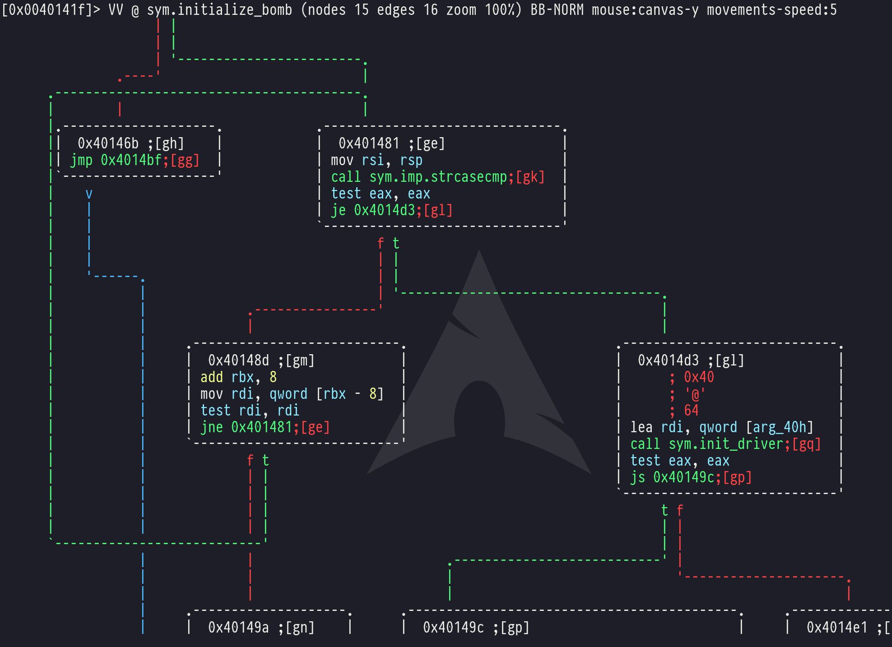
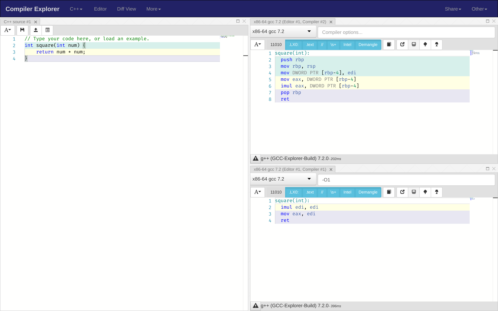

+++
title = "Helpful Tools for CSCI2021"

[taxonomies]
tags = ["old", "umn"]
+++

radare2
=======

[radare2](http://rada.re/r/) can replace GDB, and has many more analysis tools.

Installing
----------

Check your repos. It's in the repos for Arch, Ubuntu, and Homebrew (for you macOS kids).

Example of Usage
----------------

Start radare2 with `radare2 -d <program>`.

Radare2 has very terse commands, unlike GDB. Reading a tutorial is *highly*, **highly**, ***highly*** recommended; try [this one](http://sushant94.me/2015/05/31/Introduction_to_radare2/).

However, here's a cool demo of one of the more useful things. Load your bomblab file with the above commands.

Then run the commands:

```
aaa
VV @ sym.initialize_bomb
```

You can now use the arrow keys or Vim-style `hjkl` scrolling to pan around the control-flow graph of your bomb.



godbolt
=======

[godbolt](https://gcc.godbolt.org/) is a useful online tool for reading the assembly output of C code. It highlights the lines different blocks of assembly come from too, which makes reading it much easier.

Protip: Use `-O1` in the "Compiler Flags" field -- it makes the code a lot more efficient without sacrificing much readability (and sometimes improving it).



clang
=====

Clang gives much better error messages than GCC. Just replace gcc in your commands with clang. It's the default C compiler on macOS, and is installed on the CSELabs machines (and again is probably in your standard repos).

For example, instead of:

```
gcc -o main main.c
```

run

```
clang -o main main.c
```

Useful flags
------------

Other flags that can check your code include:

-	`-Wall` -- add more warnings for incorrect (and likely to crash) code
-	`-g` -- emit debug information into the program, so you can debug it easier

valgrind
========

Valgrind can help find the causes of segmentation faults and memory leaks a lot better than most programmers. Run your program with it to find them.

For example, instead of:

```
./main
```

run

```
valgrind ./main
```

Installing
----------

Check your repos.

Reading Valgrind's output
-------------------------

After running valgrind, you might get output like:

```
==30038== Memcheck, a memory error detector
==30038== Copyright (C) 2002-2017, and GNU GPL'd, by Julian Seward et al.
==30038== Using Valgrind-3.13.0 and LibVEX; rerun with -h for copyright info
==30038== Command: ./a.out
==30038==
==30038== Invalid read of size 1
==30038==    at 0x108611: main (main.c:3)
==30038==  Address 0x0 is not stack'd, malloc'd or (recently) free'd
==30038==
==30038==
==30038== Process terminating with default action of signal 11 (SIGSEGV): dumping core
==30038==  Access not within mapped region at address 0x0
==30038==    at 0x108611: main (main.c:3)
==30038==  If you believe this happened as a result of a stack
==30038==  overflow in your program's main thread (unlikely but
==30038==  possible), you can try to increase the size of the
==30038==  main thread stack using the --main-stacksize= flag.
==30038==  The main thread stack size used in this run was 8388608.
==30038==
==30038== HEAP SUMMARY:
==30038==     in use at exit: 0 bytes in 0 blocks
==30038==   total heap usage: 0 allocs, 0 frees, 0 bytes allocated
==30038==
==30038== All heap blocks were freed -- no leaks are possible
==30038==
==30038== For counts of detected and suppressed errors, rerun with: -v
==30038== ERROR SUMMARY: 1 errors from 1 contexts (suppressed: 0 from 0)
[1]    30038 segmentation fault (core dumped)  valgrind ./a.out
```

This may look difficult to read, but the important part is the middle section:

```
==30038== Invalid read of size 1
==30038==    at 0x108611: main (main.c:3)
==30038==  Address 0x0 is not stack'd, malloc'd or (recently) free'd
```

Let's break this down line-by-line.

**`Invalid read of size 1`**

The error in your program is that it tried to read one byte from memory in a way that was invalid.

The only common one-byte type is a char, so we can be pretty sure that it was that.

**`at 0x108611: main (main.c:3)`**

You can ignore `0x108611` -- it's the memory address the code was at. If it's the only piece of information present, you might've tried to call a string as a function or something similar. Otherwise, the other two pieces of information are much more useful.

We know that it's in the `main` function, specifically at line 3 of `main.c`. If a line number isn't present, compile your program with `-g` and run it again.

**`Address 0x0 is not stack'd, malloc'd or (recently) free'd`**

From this, we know that the memory address we couldn't read from was `0x0`. Since this is `NULL`, we know that we're trying to read from a null pointer. `not stack'd, malloc'd or (recently) free'd` tells us that this pointer is neither a stack nor a heap pointer, which is obviously true for `NULL`.

NASM
====

[NASM](http://nasm.us/) is an assembler that is often preferred to GAS (the assembler taught directly in class). It uses the more intuitive Intel syntax rather than the AT&T syntax used by GAS, and is versatile enough to have your entire attacklab payload be created from a single assembly file, rather than needing to stich together a bunch of `printf` calls with `cat`.

Intel vs. AT&T Syntax
---------------------

C version:

```c
int main(void) {
	int n = 20;
	while(n != 1) {
		if(n % 2 == 0) {
			n = n / 2;
		} else {
			n = 3 * n + 1;
		}
	}
	return n - 1;
}
```

GAS/AT&T Syntax version:

```asm
main:
	movl $20, %eax               # int n = 20;
	jmp .test                    # while(n != 1) {
.loop:
	testl $1, %eax
	jz .if_true                  #   if(n % 2 == 0)
.if_true:                        #   {
    shrl $1, %eax                #     n = n / 2;
	jmp .test                    #   }
.if_false:                       #   else {
	leal 1(%rax, %rax, 2), %eax  #     n = 3 * n + 1;
.test:                           #   }
	cmpl $1, %eax
	jne .loop                    # }
.end:
	dec %eax                     # return n - 1;
	ret
```

Intel Syntax version:

```asm
main:
	mov eax, 20                ; int n = 20;
	jmp .test                  ; while(n != 1) {
.loop:
	test eax, 1
	jz .if_true                ;   if(n % 2 == 0)
.if_true:                      ;   {
	shr eax, 1                 ;     n = n / 2;
	jmp .test                  ;   }
.if_false:                     ;   else {
	lea eax, [eax + 2*eax + 1] ;     n = 3 * n + 1;
.test:                         ;   }
	cmp eax, 1
	jne .loop                  ; }
.end:
	dec eax                    ; return n - 1;
	ret
```

As you can see, the Intel syntax version is more C-like (`n = 20` becomes `mov eax, 20`), and has less visual noise (`20` is obviously a number, you don't need to call it `$20`). This is especially noticeable in the `lea` instructions corresponding to `n = 3 * n + 1`:

```asm
; Intel
lea eax, [eax + 2*eax + 1]
```

```asm
# AT&T
leal 1(%rax, %rax, 2), %eax
```

I really have no idea what the person who came up with `1(%rax, %rax, 2)` was thinking...

Misc. Tips
==========

Argument Passing Order
----------------------

The mnemonic to remember is:

-	**Di**ane's
-	**Si**lk
-	**D**ress
-	**C**ost
-	**8**
-	**9**
-	**$**

From first to last, these are:

-	`r`**`di`**
-	`r`**`si`**
-	`r`**`d`**`x`
-	`r`**`c`**`x`
-	`r`**`8`**
-	`r`**`9`**
-	The **$** tack

So if we have the code:

```c
int foo(int x, unsigned int y, char* z);

int main(void) {
	foo(1, 2, NULL);
	return 0;
}
```

This will turn into the assembly:

```asm
main:
	; MOVing to a register that starts with e
	; will clear the upper half of the r register
	; that it corresponds to.
	mov edi, 1
	mov esi, 2
	xor edx, edx ; Or `mov edx, 0'
	call foo

	; return 0
	xor eax, eax
	ret
```
